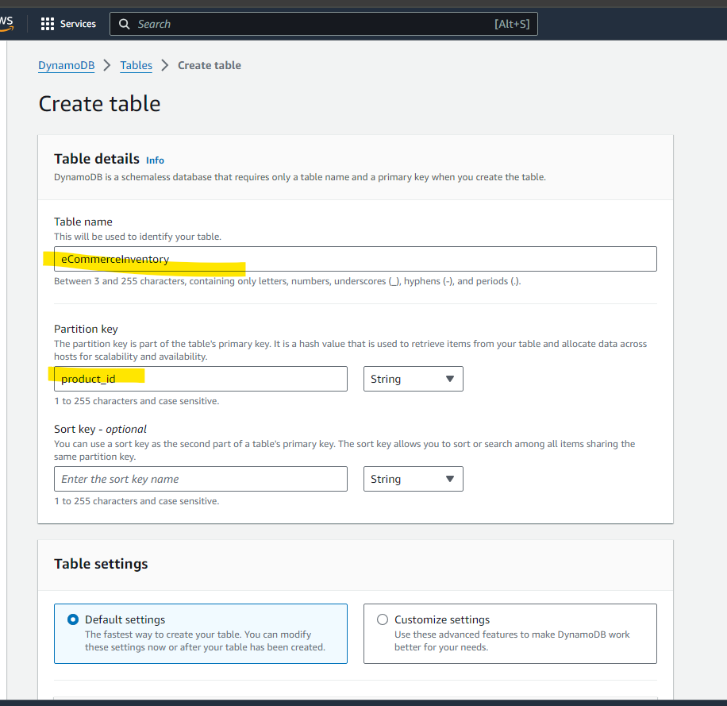

****Objective:**** Design and implement a real-time data processing pipeline in AWS to manage a simulated e-commerce platform's inventory data.

**Problem Statement:**
Your e-commerce platform needs to track real-time inventory changes for its products. Every time a product is added, removed, or its quantity changes, an event is
generated. Your task is to design a real-time processing system that will capture these events, process them, and update a real-time inventory system

**Requirements:**

○ Data Source: A mock script you'll design will simulate inventory events by generating and publishing them to an AWS Kinesis stream.

○ Event Processing: Use AWS EventBridge to capture events from the Kinesis stream and forward them for processing.

○ Data Transformation and Storage:

      ■ Process the real-time stream of data to calculate the latest inventory state for each product.
  
      ■ Store the processed data in DynamoDB, ensuring that inventory counts remain consistent and accurate.
  
■ Inventory Events Include:

    ● Product added to inventory.
  
    ● Product removed from inventory.
  
    ● Product quantity changes (increment or decrement).

  

**Architecture**

{width="6.5in" height="3.8333333333333335in"}

---\-\-\-\-\-\-\-\-\-\-\-\-\-\-\-\-\-\-\-\-\-\-\-\-\-\-\-\-\-\-\-\-\-\-\-\-\-\-\-\-\-\-\-\-\-\-\-\-\-\-\-\-\-\-\-\-\-\-\-\-\-\-\-\-\-\-\-\-\-\-\-\-\-\-\-\-\-\-\-\-\-\-\-\-\-\-\-\-\-\-\-\-\-\-\-\-\-\-\-\-\-\-\-\-\-\-\-\-\-\-\-\-\-\-\-\-\-\-\-\-\-\-\--

Can we invoke two lambda from eventbridge?

No, refer below screenshot for more

{width="6.5in" height="2.361111111111111in"}

---\-\-\-\-\-\-\-\-\-\-\-\-\-\-\-\-\-\-\-\-\-\-\-\-\-\-\-\-\-\-\-\-\-\-\-\-\-\-\-\-\-\-\-\-\-\-\-\-\-\-\-\-\-\-\-\-\-\-\-\-\-\-\-\-\-\-\-\-\-\-\-\-\-\-\-\-\-\-\-\-\-\-\-\-\-\-\-\-\-\-\-\-\-\-\-\-\-\-\-\-\-\-\-\-\-\-\-\-\-\-\-\-\-\-\-\-\-\-\-\-\-\-\--

**Step 1: Mock data generator:**

[[https://colab.research.google.com/drive/1JbkrwxnE5dcusBi5-wML_dWLJgGGNEPk#scrollTo=me6Y9IkmaZMc]{.underline}](https://colab.research.google.com/drive/1JbkrwxnE5dcusBi5-wML_dWLJgGGNEPk#scrollTo=me6Y9IkmaZMc)

**Step 2: Create Kinesis data stream**

{width="6.5in" height="3.0833333333333335in"}

Trigger the mock data and you will get this error

Exception occurs: An error occurred (AccessDeniedException) when calling
the PutRecord operation: User:
arn:aws:iam::381491939671:user/aws-de-user is not authorized to perform:
kinesis:PutRecord on resource:
arn:aws:kinesis:us-east-1:381491939671:stream/e-commerce-streaming
because no identity-based policy allows the kinesis:PutRecord action

So from kinesis we can\'t directly add permission , To resolve this
issue, you need to update the IAM policy attached to the IAM user
aws-de-user to include permissions for kinesis:PutRecord on the specific
Kinesis stream
arn:aws:kinesis:us-east-1:381491939671:stream/e-commerce-streaming.

**Step 3: Go to Iam user and update the IAM policy for the user** to
make access to this. Because you are using access key and secret key of
this user to access the kinesis from external source(google collab here)

{width="6.5in" height="3.388888888888889in"}

Above we have given kinesis all access to the IAM user aws-de-user for
all kinesis streams, but what if we want to give only record access into
only one specific kinesis stream.

Go to add permission, add inline permission and create a json with below
json string and save.

{

\"Version\": \"2012-10-17\",

\"Statement\": \[

{

\"Effect\": \"Allow\",

\"Action\": \"kinesis:PutRecord\",

\"Resource\":
\"arn:aws:kinesis:us-east-1:381491939671:stream/eCommerceStream\"

}

\]

}

Just give arn of the specific resource in the Resource key

Now we have data inserted from a mock data generator into Kinesis shard.

{width="6.5in" height="3.3489588801399823in"}

**Step 4: Create a lambda function that will connect to kinesis stream
directly and read data and update dynamo DB**

{width="6.5in" height="2.9444444444444446in"}

**Step 5: Set up AWS EventBridge to capture the events from the Kinesis
stream.**

{width="6.5in" height="3.25in"}

Connect Kinesis stream to lambda that we created in step 4

This lambda itself can send sns or alerts if the threshold value is
crossed. Eg: Quantity exceeds 1000, send SNS.

Step 6: Create DynamoDB to store the inventory details

{width="6.5in" height="6.305555555555555in"}

**Can we delete from Kinesis**

To delete items from an Amazon Kinesis stream, you need to understand
that Kinesis streams are designed for append-only operations. You can\'t
directly delete individual records from a Kinesis stream. Instead,
records in a Kinesis stream expire based on the stream\'s retention
period, which can be set between 24 hours and 365 days.

Step 7: Remember to give necessary permissions to lambda, and
eventbridge pipe.

Eventbridge IAM policy

{width="6.5in" height="3.4583333333333335in"}

Lambda function IAM policy

{width="6.5in" height="3.513888888888889in"}

Data inserted from mock data generator

{width="6.5in" height="2.861111111111111in"}

Kinesis stream has data

{width="6.5in" height="3.3333333333333335in"}

Through event bridge to lambda and from lambda data landed in dynamoDB

{width="6.5in" height="3.2777777777777777in"}

Did some updates, insert from mock data generator

{width="6.5in" height="2.2916666666666665in"}

Into shrad 1 two additional records

{width="6.5in" height="3.1527777777777777in"}

Others 3 in shrad2

{width="6.5in" height="3.4444444444444446in"}

After one add event

sample_dict = {

\'Watch\': 6

}

{width="6.5in" height="2.6805555555555554in"}

Now remove Oven

{width="6.5in" height="2.9166666666666665in"}

{width="6.5in" height="4.152777777777778in"}

Oven removed from dynamoDB

{width="6.5in" height="2.3055555555555554in"}

Updating quantity

{width="6.5in" height="4.305555555555555in"}

Quantity of phone updated

{width="6.5in" height="3.1527777777777777in"}
